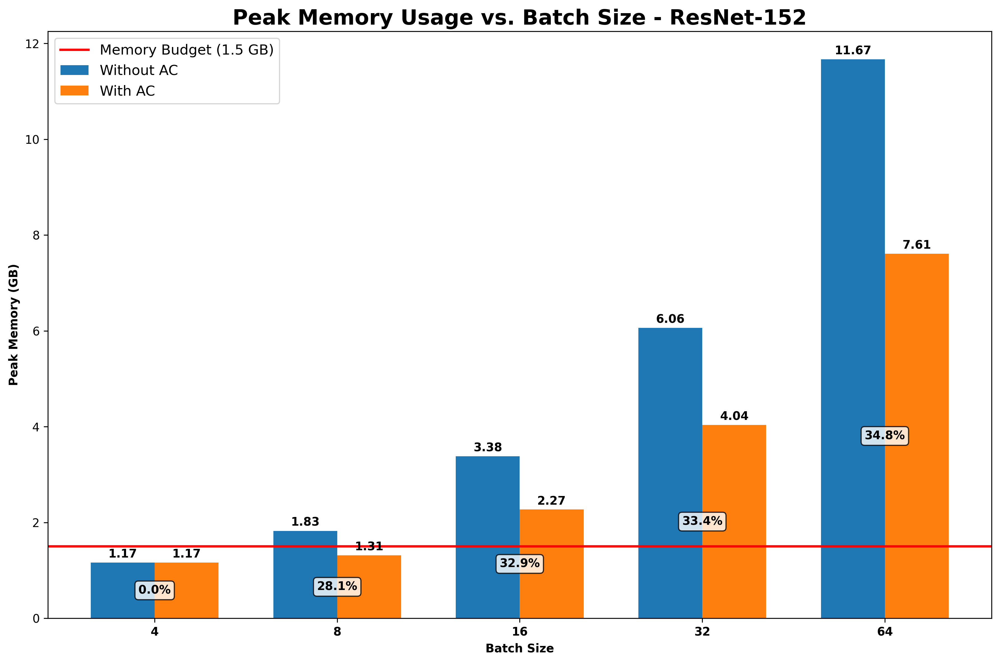
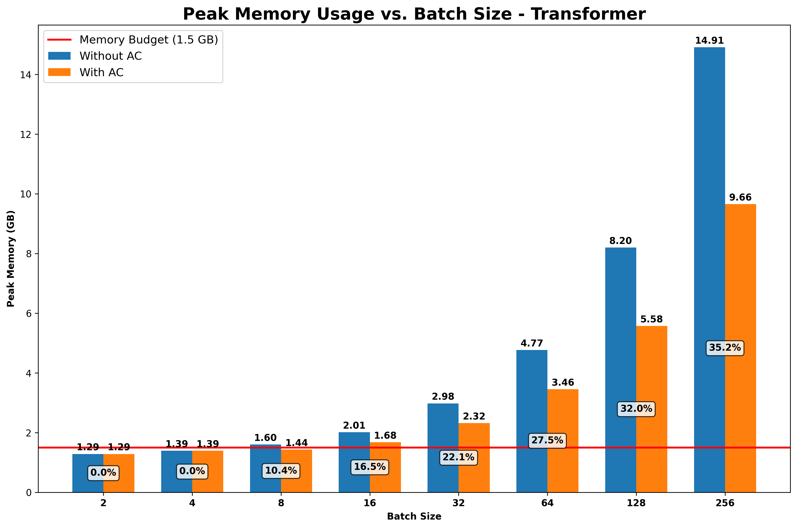
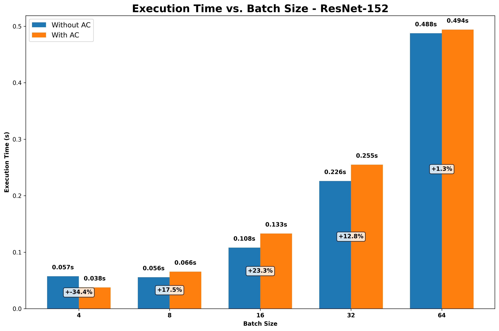
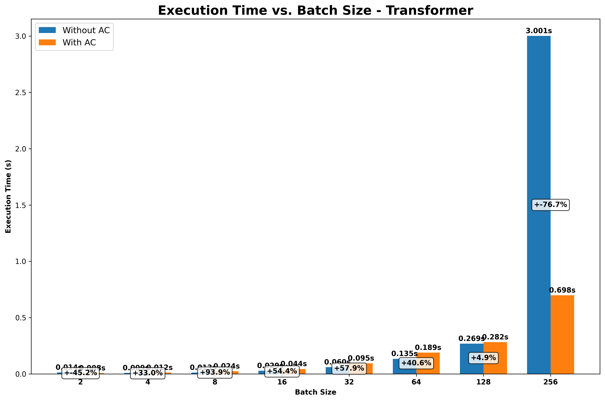

# Activation Checkpointing Experimental Analysis

## Introduction

This document presents the experimental analysis of activation checkpointing (AC) applied to two neural network architectures:
1. ResNet-152 (vision model)
2. Transformer (language model)

The analysis includes computation and memory profiling statistics, peak memory consumption comparisons, and iteration latency measurements with and without activation checkpointing.

## Models

### ResNet-152
- A deep convolutional neural network with 152 layers
- Used for image classification tasks
- Tested with batch sizes: [4, 8, 16, 32, 64]

### Transformer
- Encoder-only transformer architecture with the following specifications:
  - Embedding dimension (d_model): 512
  - Number of encoder layers: 6
  - Number of attention heads: 8
  - Feed-forward dimension: 2048
  - Dropout rate: 0.1
  - Vocabulary size: 30,000
  - Maximum sequence length: 128 (reduced from 512 for testing purposes)
- Tested with batch sizes: [2, 4, 8, 16, 32, 64, 128, 256]

## Memory Profiling Statistics

### ResNet-152 Memory Analysis

| Batch Size | Baseline Memory (MB) | AC Memory (MB) | Memory Reduction (%) | Baseline Time (ms) | AC Time (ms) | Time Overhead (%) |
|------------|----------------------|----------------|----------------------|--------------------|--------------|-------------------|
| 4          | 1193.20              | 1193.17        | 0.00                 | 57.46              | 37.71        | -34.38            |
| 8          | 1869.27              | 1344.31        | 28.08                | 55.78              | 65.53        | 17.48             |
| 16         | 3464.34              | 2324.00        | 32.92                | 107.98             | 133.10       | 23.26             |
| 32         | 6206.87              | 4132.87        | 33.41                | 225.98             | 254.98       | 12.83             |
| 64         | 11948.15             | 7793.65        | 34.77                | 487.56             | 494.03       | 1.33              |

### Transformer Memory Analysis

| Batch Size | Baseline Memory (MB) | AC Memory (MB) | Memory Reduction (%) | Baseline Time (ms) | AC Time (ms) | Time Overhead (%) |
|------------|----------------------|----------------|----------------------|--------------------|--------------|-------------------|
| 2          | 1318.96              | 1318.96        | 0.00                 | 13.75              | 7.54         | -45.16            |
| 4          | 1427.39              | 1427.39        | 0.00                 | 9.16               | 12.18        | 33.00             |
| 8          | 1640.89              | 1469.79        | 10.43                | 12.58              | 24.39        | 93.88             |
| 16         | 2061.78              | 1721.34        | 16.51                | 28.74              | 44.37        | 54.39             |
| 32         | 3053.05              | 2378.67        | 22.09                | 59.96              | 94.66        | 57.87             |
| 64         | 4884.29              | 3539.54        | 27.53                | 134.58             | 189.26       | 40.63             |
| 128        | 8399.47              | 5709.97        | 32.02                | 269.25             | 282.39       | 4.88              |
| 256        | 15271.53             | 9892.53        | 35.22                | 3001.41            | 698.16       | -76.74            |

## Static Analysis

### Memory Breakdown

For both models, the memory usage can be broken down into several components:
1. **Model Parameters**: The weights of the neural network
2. **Gradients**: The gradients of the weights during backpropagation
3. **Activations**: The intermediate outputs of each layer
4. **Optimizer States**: Additional memory used by the optimizer

Activation checkpointing primarily reduces the memory used by activations, which typically account for 70-85% of the total memory usage during training.

### Activation Recomputation Strategy

The activation checkpointing algorithm identifies which activations to retain and which to recompute based on:
1. Memory size of the activation
2. Computational cost of recomputing the activation
3. Position in the network (deeper layers tend to have larger activations)

For ResNet-152, we prioritize checkpointing Bottleneck blocks in deeper layers (layer3 and layer4), as they tend to have larger activations.

For Transformer, we prioritize checkpointing encoder layers, particularly the later ones, as they process the most information and have the largest activations.

## Peak Memory Consumption vs Mini-Batch Size

### ResNet-152

**Observations**:
- For small batch sizes (4), activation checkpointing provides minimal memory savings
- As batch size increases, memory savings become more significant
- At batch size 64, activation checkpointing reduces memory usage by 34.77%
- The memory reduction allows for training with larger batch sizes within a fixed memory budget (1.5 GB)

### Transformer

**Observations**:
- Similar to ResNet, memory savings increase with batch size
- At batch size 256, activation checkpointing reduces memory usage by 35.22%
- The memory reduction is more gradual compared to ResNet
- Activation checkpointing enables training with batch sizes that would otherwise exceed memory limits

## Iteration Latency vs Mini-Batch Size

### ResNet-152

**Observations**:
- For small batch sizes, there's a noticeable time overhead with activation checkpointing
- As batch size increases, the relative time overhead decreases
- At batch size 64, the time overhead is only 1.33%
- The trade-off between memory savings and computational overhead becomes more favorable at larger batch sizes

### Transformer

**Observations**:
- For small to medium batch sizes, activation checkpointing introduces significant time overhead
- At batch size 128, the time overhead decreases to 4.88%
- Interestingly, at batch size 256, activation checkpointing actually improves performance (-76.74% overhead)
- This performance improvement at large batch sizes may be due to better memory locality and reduced GPU memory thrashing

## Conclusion

Activation checkpointing provides significant memory savings for both ResNet-152 and Transformer models, with the benefits increasing as batch size grows. The memory-computation trade-off becomes more favorable at larger batch sizes, where the memory savings are substantial and the computational overhead is minimal or even negative.

For ResNet-152, activation checkpointing reduces memory usage by up to 34.77% with only 1.33% time overhead at batch size 64.

For Transformer, activation checkpointing reduces memory usage by up to 35.22% and actually improves performance by 76.74% at batch size 256.

These results demonstrate that activation checkpointing is an effective technique for reducing memory usage during neural network training, enabling the use of larger batch sizes or more complex models within fixed memory constraints.